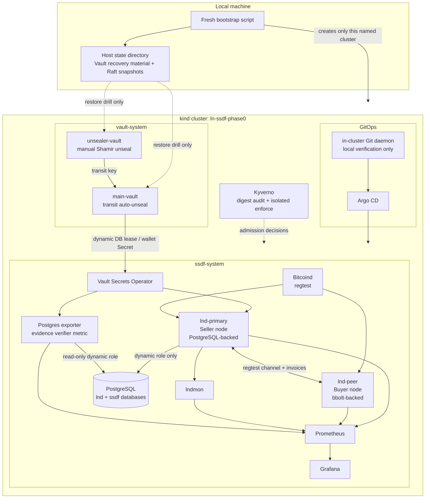

# ln-ssdf

`ln-ssdf` is a reproducible, local Kubernetes platform that applies NIST SSDF
and supply-chain controls to a Lightning Network workload. Its completed scope
is Phase 0–8: a regtest Bitcoin/LND payment environment, dynamic secrets,
GitOps, runtime policy gates, observability, and tamper-evident evidence
projection.

The project is intentionally explicit about what it proves locally and what it
does not claim. It is a portfolio-grade verification environment, not a
production Lightning deployment.

## Current status

| Phase | Outcome | Verified local capability |
| --- | --- | --- |
| 0 | Complete | kind cluster, PostgreSQL, append-only evidence schema |
| 1 | Complete | dual Vault, transit auto-unseal, VSO dynamic DB leases, Raft restore drill |
| 2 | Complete | isolated regtest chain, seller/buyer LND nodes, bidirectional payment drill |
| 3 | Complete | Prometheus, Grafana, LND/LNDmon, PostgreSQL evidence metrics |
| 4 | Complete | Argo CD app-of-apps reconciliation from an in-cluster Git source |
| 5 | Complete | GitHub OIDC keyless source provenance verification |
| 6 | Complete | Kyverno digest audit and isolated enforce test |
| 7 | Diagnostic gate complete | SBOM/VSA binding and verified inventory; vulnerability-based production enforcement remains disabled |
| 8 | Complete | evidence-chain tamper detector, Prometheus alert, reversible local drill |

The next design is documented in [Phase 9–12 plan](docs/phase-9-12-plan.md).
It is not part of the completed Phase 0–8 claim.

## Architecture

### Runtime and trust boundaries



### What each boundary protects

| Boundary | Design |
| --- | --- |
| Wallet and recovery material | Seeds and wallet passwords originate in Vault KV and are synchronized by VSO. Vault initialization files and Raft snapshots live only in an explicit host state directory outside Git. |
| Database access | `lnd-primary` receives a renewable Vault-issued PostgreSQL principal that assumes the non-login `lnd_runtime` role. The bootstrap superuser is not an application credential. |
| Payment path | `lnd-primary` is the seller and `lnd-peer` the buyer. The acceptance drill opens a regtest channel, then settles invoices in both directions. |
| Deployment source | Argo CD reconciles a pinned local Git revision through an in-cluster Git daemon. This proves local GitOps mechanics, not a production SCM service. |
| Admission | Kyverno audits digest pinning in `ssdf-system` and enforces the same rule only in an isolated test namespace. |
| Evidence | PostgreSQL is a query projection with an append-only hash chain. Rekor remains the authority for signed attestations; the local chain detector does not replace Rekor checkpoint verification. |
| Observability | Prometheus scrapes both LND nodes, lndmon, and the PostgreSQL exporter. Grafana is ClusterIP-only with anonymous access disabled. |

## Reproduce Phase 0–8 from zero

### Prerequisites

- Docker with Linux containers
- kind, kubectl, Helm
- Git, Node.js 20+, jq, curl, OpenSSL, tar, and a SHA-256 utility
- A new, absolute host directory outside this repository for Vault recovery
  material

The one-command bootstrap deletes and recreates **only** the local kind cluster
named `ln-ssdf-phase0`. It rejects a non-empty state directory before deleting
the cluster, preserving existing recovery material.

```bash
scripts/fresh-local-bootstrap.sh \
  --state-dir "$HOME/.local/state/ln-ssdf-phase1-new" \
  --confirm-recreate
```

The command creates fresh regtest, Vault, wallet, channel, and payment state.
It does not restore a prior Lightning channel. It verifies, in order:

1. PostgreSQL schema and PVC
2. Vault + VSO dynamic credentials and fresh Raft snapshots
3. Seller/buyer LND startup, channel creation, and bidirectional payment
4. Prometheus scrape gate and Grafana deployment
5. Argo CD local GitOps gate
6. Kyverno audit/enforcement gate
7. Evidence-chain health metric

For phase-specific recovery and destructive-drill scope, see
[Phase 1](docs/phase-1.md), [Phase 2](docs/phase-2.md), and
[Phase 3](docs/phase-3.md).

## Local observability access

After bootstrap, use separate terminals:

```bash
kubectl --context kind-ln-ssdf-phase0 -n ssdf-system \
  port-forward service/grafana 13000:3000
kubectl --context kind-ln-ssdf-phase0 -n ssdf-system \
  port-forward service/prometheus 19090:9090
kubectl --context kind-ln-ssdf-phase0 -n ssdf-system \
  port-forward service/lnd-primary 19092:9092
kubectl --context kind-ln-ssdf-phase0 -n ssdf-system \
  port-forward service/lnd-primary 18989:8989
```

- Grafana: <http://localhost:13000> (`admin`; retrieve the runtime-only
  password from `grafana-admin` Secret)
- Prometheus: <http://localhost:19090>
- LNDmon metrics: <http://localhost:19092/metrics>
- Raw seller LND metrics: <http://localhost:18989/metrics>

```bash
kubectl --context kind-ln-ssdf-phase0 -n ssdf-system get secret grafana-admin \
  -o jsonpath='{.data.admin-password}' | base64 -d; echo
```

## Verification and evidence

```bash
npm test

scripts/phase8-tamper-drill.sh \
  --context kind-ln-ssdf-phase0 \
  --confirm-local-tamper-drill
```

The Phase 8 drill intentionally alters a dedicated local fixture, proves the
PostgreSQL verifier produces `ssdf_evidence_chain_tamper_detected = 1`, observes
the Prometheus alert, restores the claim, and verifies alert resolution. It is
guarded to the named local kind cluster.

## Explicit limitations

- No production HA, external Alertmanager receiver, backup RPO/RTO, or
  namespace-wide default-deny claim.
- No production vulnerability-based admission enforcement while the signed VSA
  evidence contains blocking findings.
- No proof of recovery for intentionally discarded regtest channels.
- No claim that the local Git daemon, local recovery material, or single-replica
  services are production-ready.
- Phase 9–12 components such as Aperture, OpenCTI, AgentGateway, Loki, Tempo,
  kagent, and Chaos Mesh are planned only until their own gates are implemented
  and verified.

## Documentation map

- [Project handoff and verified status](AI-HANDOFF.md)
- [Design decisions](docs/design-decisions.md)
- [Phase 0–8 documentation](docs)
- [Evidence dashboard](docs/evidence-dashboard.md)
- [Known limitations](docs/appendix-b.md)
- [Phase 9–12 design](docs/phase-9-12-plan.md)
