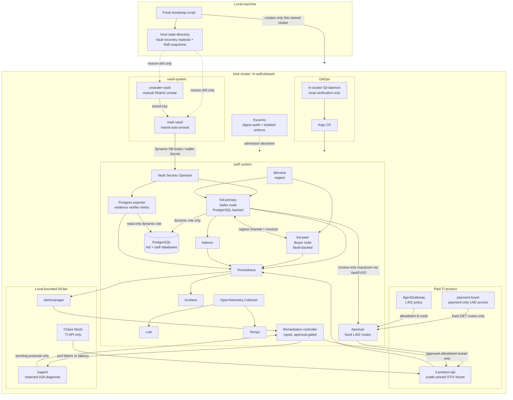

# ln-ssdf

`ln-ssdf` is a reproducible, local Kubernetes platform that applies NIST SSDF
and supply-chain controls to a Lightning Network workload. Its verified local
scope is Phase 0–12: a regtest Bitcoin/LND payment environment, dynamic
secrets, GitOps, runtime policy gates, a paid threat-intelligence slice,
observability, bounded AIOps, and tamper-evident evidence projection.

The project is intentionally explicit about what it proves locally and what it
does not claim. It is a portfolio-grade verification environment, not a
production Lightning deployment.

## Current status

| Phase | Outcome | Verified local capability |
| --- | --- | --- |
| 0 | Complete | kind cluster, PostgreSQL, append-only evidence schema |
| 1 | Complete | dual Vault, transit auto-unseal, VSO dynamic DB leases, Raft restore drill |
| 2 | Complete | isolated regtest chain, seller/buyer LND nodes, bidirectional payment drill |
| 3 | Complete | Prometheus, Grafana, LND/LNDmon, PostgreSQL evidence metrics |
| 4 | Complete | Argo CD app-of-apps reconciliation from an in-cluster Git source |
| 5 | Complete | GitHub OIDC keyless source provenance verification |
| 6 | Complete | Kyverno digest audit and isolated enforce test |
| 7 | Diagnostic gate complete | SBOM/VSA binding and verified inventory; vulnerability-based production enforcement remains disabled |
| 8 | Complete | evidence-chain tamper detector, Prometheus alert, reversible local drill |
| 9 | Verified locally | fixed-route L402 challenge, one 10-sat regtest invoice settlement, authorized retry, and independent ledger/API-counter checks |
| 10 | Verified locally | AgentGateway L402 route policy forwards an allowlisted challenge and rejects an unallowlisted TI route |
| 11 | Verified locally | Loki, Tempo, OpenTelemetry Collector, TI API scrape/rules, and redaction gate on a fresh local rebuild |
| 12 | Verified locally, approval-gated | typed kind approval/restart succeeds; the opt-in real Chaos Mesh → Prometheus → Alertmanager → kagent → scoped approval path succeeded; both TI API-only pod-failure and latency drills recovered |

“Verified locally” means the named kind context and the scripts below were
exercised in this repository. It does not mean every planned integration is
complete: Phase 9 uses a public pinned STIX fixture by default rather than a
bootstrapped OpenCTI deployment, and Phase 12 intentionally requires a human
approval boundary before remediation.

## Architecture

### Runtime and trust boundaries



### What each boundary protects

| Boundary | Design |
| --- | --- |
| Wallet and recovery material | Seeds and wallet passwords originate in Vault KV and are synchronized by VSO. Vault initialization files and Raft snapshots live only in an explicit host state directory outside Git. |
| Database access | `lnd-primary` receives a renewable Vault-issued PostgreSQL principal that assumes the non-login `lnd_runtime` role. The bootstrap superuser is not an application credential. |
| Payment path | `lnd-primary` is the seller and `lnd-peer` the buyer. Phase 9 confines a payment-only buyer to fixed TI GET routes, a 50-sat invoice ceiling, a 100-sat run ceiling, and a 200-sat UTC-day ceiling; its fresh drill settles one 10-sat invoice and independently checks the ledger and API access counter. |
| Paid TI and gateway | Aperture protects the three fixed TI product routes. The Rust API serves a pinned public STIX fixture locally; the AgentGateway policy allows only the configured L402 TI route. This is not a bootstrapped OpenCTI service or a general payment gateway. |
| Deployment source | Argo CD reconciles a pinned local Git revision through an in-cluster Git daemon. This proves local GitOps mechanics, not a production SCM service. |
| Admission | Kyverno audits digest pinning in `ssdf-system` and enforces the same rule only in an isolated test namespace. |
| Evidence | PostgreSQL is a query projection with an append-only hash chain. Rekor remains the authority for signed attestations; the local chain detector does not replace Rekor checkpoint verification. |
| Observability | Prometheus scrapes both LND nodes, lndmon, and the PostgreSQL exporter. Grafana is ClusterIP-only with anonymous access disabled. |
| AIOps and chaos | Alertmanager sends a bounded local webhook to a controller which dispatches redacted A2A diagnosis to kagent. It can create only a pending typed request; a separately scoped operator approval is required before the controller restarts an allowlisted workload. Chaos Mesh targets only the TI API pod-failure and latency experiments. |

## Reproduce Phase 0–12 from zero

### Prerequisites

- Docker with Linux containers
- kind, kubectl, Helm
- Git, Node.js 20+, jq, curl, OpenSSL, tar, and a SHA-256 utility
- A new, absolute host directory outside this repository for Vault recovery
  material

The one-command bootstrap deletes and recreates **only** the local kind cluster
named `ln-ssdf-phase0`. It rejects a non-empty state directory before deleting
the cluster, preserving existing recovery material.

```bash
scripts/fresh-local-bootstrap.sh \
  --state-dir "$HOME/.local/state/ln-ssdf-phase1-new" \
  --confirm-recreate
```

The command creates fresh regtest, Vault, wallet, channel, and payment state.
It does not restore a prior Lightning channel. It verifies, in order:

1. PostgreSQL schema and PVC
2. Vault + VSO dynamic credentials and fresh Raft snapshots
3. Seller/buyer LND startup, channel creation, and bidirectional payment
4. Prometheus scrape gate and Grafana deployment
5. Argo CD local GitOps gate
6. Kyverno audit/enforcement gate
7. Evidence-chain health metric

Then run the Phase 9–12 local gates in order. Replace `/absolute/state-dir`
with the same external state directory supplied to the fresh bootstrap. Phase
9 acceptance is intentionally single-use per fresh environment: it refuses to
mint another 10-sat invoice if one has already settled.

```bash
scripts/phase9-bootstrap.sh --context kind-ln-ssdf-phase0 \
  --state-dir /absolute/state-dir
scripts/phase9-acceptance.sh --context kind-ln-ssdf-phase0 \
  --subject threat-research-buyer

scripts/phase10-build-local.sh --context kind-ln-ssdf-phase0
scripts/phase10-bootstrap.sh --context kind-ln-ssdf-phase0
scripts/phase10-acceptance.sh --context kind-ln-ssdf-phase0

scripts/phase11-bootstrap.sh --context kind-ln-ssdf-phase0

scripts/phase12-kind-acceptance.sh --context kind-ln-ssdf-phase0 \
  --confirm-local-approval
scripts/phase12-kagent-bootstrap.sh --context kind-ln-ssdf-phase0 \
  --confirm-local-kagent
scripts/phase12-alertmanager-bootstrap.sh --context kind-ln-ssdf-phase0 \
  --confirm-local-alert-routing
scripts/phase12-aiops-acceptance.sh --context kind-ln-ssdf-phase0 \
  --confirm-local-aiops --confirm-local-approval
scripts/phase12-chaos-drill.sh --context kind-ln-ssdf-phase0 \
  --experiment pod-failure --confirm-local-chaos
scripts/phase12-chaos-drill.sh --context kind-ln-ssdf-phase0 \
  --experiment latency --confirm-local-chaos
```

The primary Phase 12 live gate is the real Chaos-driven path above. The
explicit `--confirm-local-approval` opt-in mints a scoped operator token only
after the new pending request is observed and Chaos recovery finishes, then
proves the approved TI API restart and redacted evidence. Omit that flag to
stop at the pending-request boundary:

```bash
scripts/phase12-aiops-acceptance.sh --context kind-ln-ssdf-phase0 \
  --confirm-local-aiops
```

The synthetic Alertmanager-to-approval gate is optional rather than a required
reproduction step:

```bash
scripts/phase12-a2a-e2e-acceptance.sh --context kind-ln-ssdf-phase0 \
  --confirm-local-a2a-acceptance
```

Phase 10 uses local Ollama `gpt-oss:20b` through AgentGateway. Start Ollama on
the Docker host and pull that model before bootstrapping Phase 10. No provider
credential is required.

For phase-specific recovery and destructive-drill scope, see
[Phase 1](docs/phase-1.md), [Phase 2](docs/phase-2.md), and
[Phase 3](docs/phase-3.md).

## Local observability access

After bootstrap, use separate terminals:

```bash
kubectl --context kind-ln-ssdf-phase0 -n ssdf-system \
  port-forward service/grafana 13000:3000
kubectl --context kind-ln-ssdf-phase0 -n ssdf-system \
  port-forward service/prometheus 19090:9090
kubectl --context kind-ln-ssdf-phase0 -n ssdf-system \
  port-forward service/lnd-primary 19092:9092
kubectl --context kind-ln-ssdf-phase0 -n ssdf-system \
  port-forward service/lnd-primary 18989:8989
```

- Grafana: <http://localhost:13000> (`admin`; retrieve the runtime-only
  password from `grafana-admin` Secret)
- Prometheus: <http://localhost:19090>
- LNDmon metrics: <http://localhost:19092/metrics>
- Raw seller LND metrics: <http://localhost:18989/metrics>

```bash
kubectl --context kind-ln-ssdf-phase0 -n ssdf-system get secret grafana-admin \
  -o jsonpath='{.data.admin-password}' | base64 -d; echo
```

## Verification and evidence

```bash
npm test

scripts/phase8-tamper-drill.sh \
  --context kind-ln-ssdf-phase0 \
  --confirm-local-tamper-drill
```

The Phase 8 drill intentionally alters a dedicated local fixture, proves the
PostgreSQL verifier produces `ssdf_evidence_chain_tamper_detected = 1`, observes
the Prometheus alert, restores the claim, and verifies alert resolution. It is
guarded to the named local kind cluster.

## Explicit limitations

- No production HA, external Alertmanager receiver, backup RPO/RTO, or
  namespace-wide default-deny claim.
- No production vulnerability-based admission enforcement while the signed VSA
  evidence contains blocking findings.
- No proof of recovery for intentionally discarded regtest channels.
- No claim that the local Git daemon, local recovery material, or single-replica
  services are production-ready.
- No production claim for Lightning custody, L402 availability, OpenCTI,
  AgentGateway, observability, AIOps, Chaos Mesh, or any external provider.
- Phase 9's default source is a public pinned STIX fixture. A real OpenCTI
  GraphQL deployment and its dependencies are not bootstrapped here.
- The Phase 12 model path uses a local AgentGateway integration with Ollama
  `gpt-oss:20b`. Availability, latency, and diagnosis quality can vary; a timeout or
  uncertain diagnosis remains pending or needs human review rather than
  authorizing a restart. The synthetic A2A gate is therefore not deterministic
  and is not required to establish the real Chaos-driven acceptance result.
- The verified Chaos drills are TI API-only local recovery checks, not a
  production resilience, SLO, or incident-response claim.

## Documentation map

- [Project handoff and verified status](AI-HANDOFF.md)
- [Design decisions](docs/design-decisions.md)
- [Phase 0–12 documentation](docs)
- [Evidence dashboard](docs/evidence-dashboard.md)
- [Known limitations](docs/appendix-b.md)
- [Phase 9–12 design and boundaries](docs/phase-9-12-plan.md)
